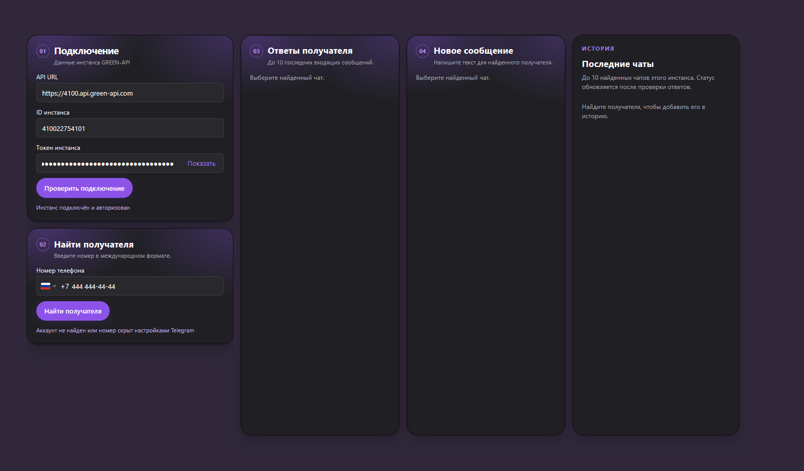
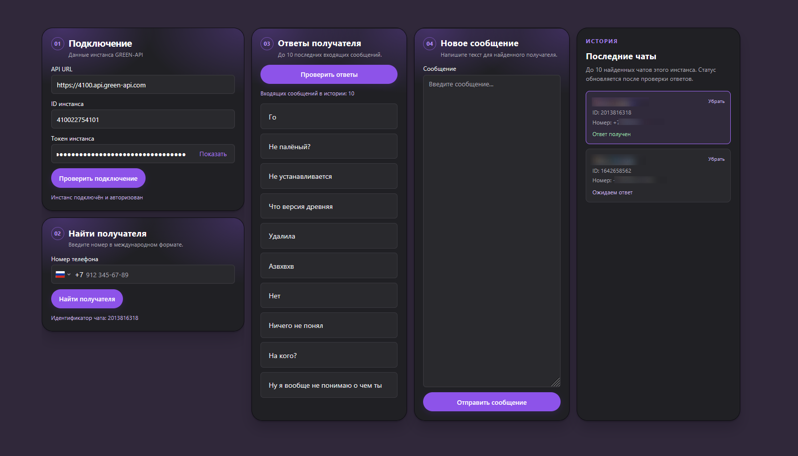
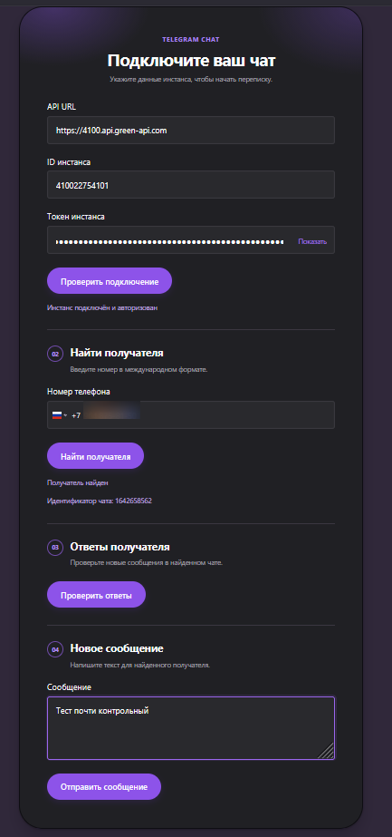
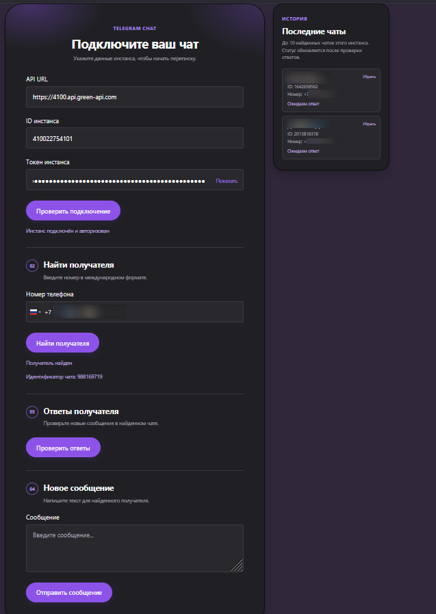

# Telegram Chat

Небольшое веб-приложение для переписки через **GREEN-API для Telegram**. Оно проверяет подключение инстанса, находит получателя по номеру телефона, отправляет текст и показывает последние входящие сообщения выбранного чата.

## Возможности

- Проверка состояния инстанса GREEN-API.
- Поиск Telegram-аккаунта по номеру и отображение ID чата, номера и доступного имени.
- Отправка текстового сообщения длиной до 4096 символов.
- Ручная загрузка до 10 последних входящих сообщений выбранного чата.
- История до 10 найденных чатов: выбор, статус ответа на последнее отправленное сообщение и удаление записи.

## Интерфейс

Текущая раскладка состоит из этапов подключения, поиска получателя, проверки ответов и отправки сообщения. История чатов находится справа. Длинные списки сообщений и чатов прокручиваются внутри своих блоков.





<details>
<summary>Ранние варианты интерфейса</summary>





</details>

## Что нужно для запуска

- Node.js и npm, совместимые с версиями зависимостей в `client/package.json` и `server/package.json`.
- Авторизованный инстанс GREEN-API для Telegram. Из кабинета GREEN-API понадобятся **API URL**, **ID инстанса** и **токен инстанса**.

В первом терминале запустите сервер:

```powershell
cd server
npm ci
npm run dev
```

Во втором терминале из корня проекта запустите клиент:

```powershell
cd client
npm ci
npm run dev
```

Сервер слушает `http://localhost:3001`. Адрес клиента Vite покажет в терминале; обычно это `http://localhost:5173`. Во время разработки запросы `/api` с клиента перенаправляются на локальный сервер.

## Как пользоваться

1. Введите API URL, ID и токен инстанса, затем нажмите **«Проверить подключение»**. Поиск получателя доступен после ответа `authorized`.
2. Введите номер в международном формате и нажмите **«Найти получателя»**. Найденный чат появится в истории; его можно выбрать повторно или убрать из списка.
3. Напишите текст и нажмите **«Отправить сообщение»**. Показанный ID означает, что GREEN-API принял сообщение в очередь отправки; это не подтверждение доставки.
4. Нажмите **«Проверить ответы»** для выбранного чата. Приложение прочитает его историю и покажет до 10 последних входящих сообщений. Автоматического обновления нет.

Статус **«Ответ получен»** в истории ставится, когда при проверке найдено входящее сообщение с временем не раньше последней отправки из приложения. Это локальная отметка, а не статус доставки исходящего сообщения.

## Устройство проекта

| Путь | Назначение |
| --- | --- |
| `client/` | Интерфейс на React, Vite и `intl-tel-input`. |
| `server/index.js` | Express API и запросы к GREEN-API. |
| `server/incoming-messages.js` | Отбор входящих сообщений из истории чата. |
| `server/incoming-messages.test.js` | Проверки отбора сообщений. |
| `img/` | Скриншоты интерфейса. |
| [API.md](API.md) | Памятка по локальным маршрутам и методам GREEN-API. |

Параметры подключения вводятся в форме и отправляются локальному серверу с нужным запросом. Токен не сохраняется в `localStorage`. История чатов (ID, номер, имя и статус) хранится в `localStorage` этого браузера отдельно для каждого API URL и ID инстанса; общей базы данных в проекте нет.

## Проверка проекта

```powershell
cd client
npm run lint
npm run build
```

```powershell
cd server
node --test incoming-messages.test.js
```

`npm test` в `server/` пока является шаблонной командой и тесты не запускает.
